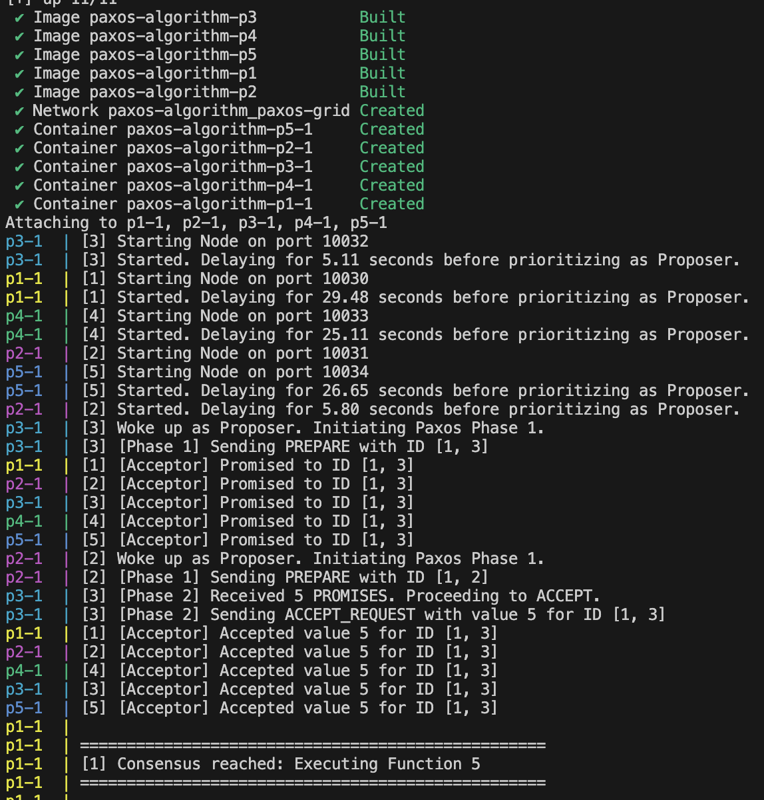
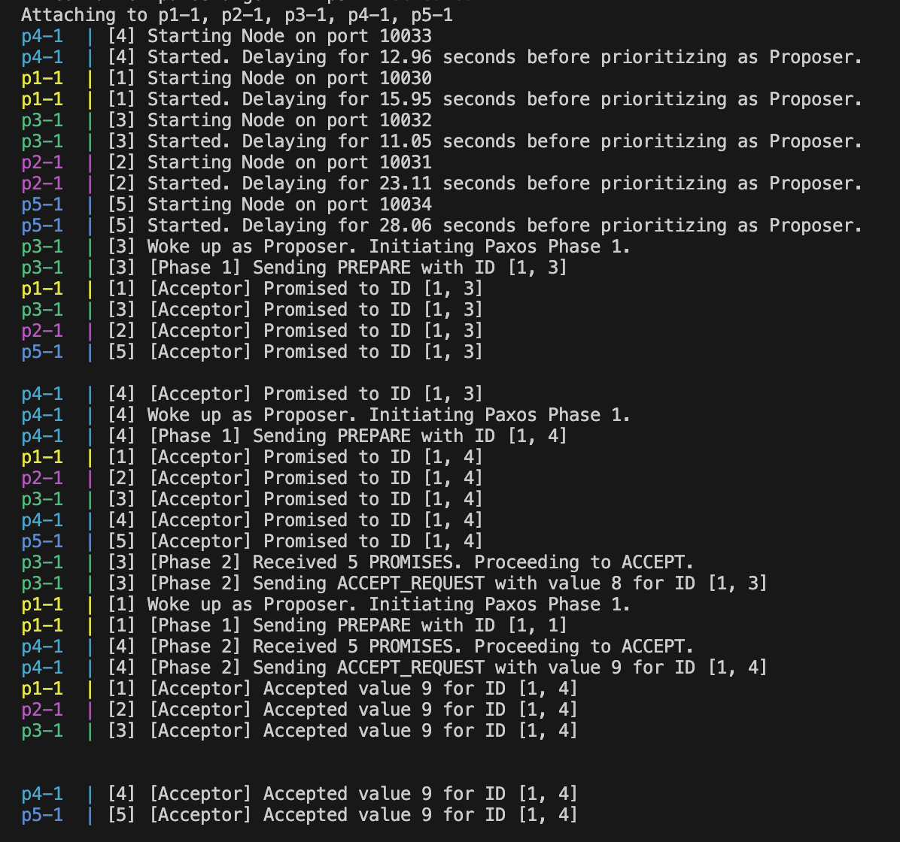

# Paxos Consensus Algorithm Implementation

This project implements a distributed consensus system using the Paxos Algorithm in Python, simulating a network of nodes via Docker containers that must agree on a single value (a function ID from a list of 1 to 10).

## System Architecture

- **Nodes**: 5 identical nodes run as independent Docker containers (`p1` to `p5`).
- **Communication**: UDP Sockets. Each node is assigned a specific port (10030 to 10034) and broadcasts JSON-encoded messages to its peers over a private Docker bridge network. UDP simulates unreliable real-world network infrastructure.
- **Race Condition Simulation**: Each node starts up with a random delay between 1 and 30 seconds. The node that wakes up earliest is likely to become the leading Proposer.

## Roles

Each script instantiation fulfills all three Paxos roles concurrently:

1. **Proposer**: Selects a unique sequence number and initiates Phase 1 (`PREPARE`) and Phase 2 (`ACCEPT_REQUEST`).
2. **Acceptor**: Triggers on incoming requests, acting as the quorum memory. It only promises or accepts proposals with a sequence number strictly greater than or equal to what it has previously seen, sending back `PROMISE` or broadcasting `ACCEPTED` messages.
3. **Learner**: Monitors the network for `ACCEPTED` broadcast messages. Once a specific value is accepted by a majority (3 out of 5 nodes), the learner concludes that consensus is reached, logs the success, and halts participation.

## How to Run

1. Ensure you have Docker and Docker Compose installed.
2. In the project directory, build and start the cluster:
   ```bash
   docker-compose up --build
   ```

3. Watch the logs. You will see:
   - Nodes assigning themselves random delays and waking up.
   - The fastest node waking up and broadcasting a `PREPARE` request.
   - Other nodes responding with `PROMISE`.
   - The Proposer sending an `ACCEPT_REQUEST` for a random ID (between 1 and 10).
   - Nodes broadcasting `ACCEPTED`.
   - Finally, a consensus completion message from every node indicating the agreed-upon ID:
     `Consensus reached: Executing Function [ID]`

Once a node reaches consensus, it idles gracefully to keep the Docker container alive for debug logging. You can shut the simulation down with `Ctrl+C` or `docker-compose down`.

## Execution & Output

Below are examples of different execution scenarios triggered by the random startup delays:

### Scenario 1: First Proposer Wins
In this execution, the node that wakes up first successfully completes Phase 1 (`PREPARE`) and Phase 2 (`ACCEPT_REQUEST`) without being interrupted by a higher sequence number proposal, achieving consensus on its value.



### Scenario 2: First Proposer loses
In this scenario, a node wakes up and starts proposing, but before it can gather promises and secure the consensus, a second node wakes up with a higher sequence number (or same sequence but higher node ID) and overrides the accept phase.


