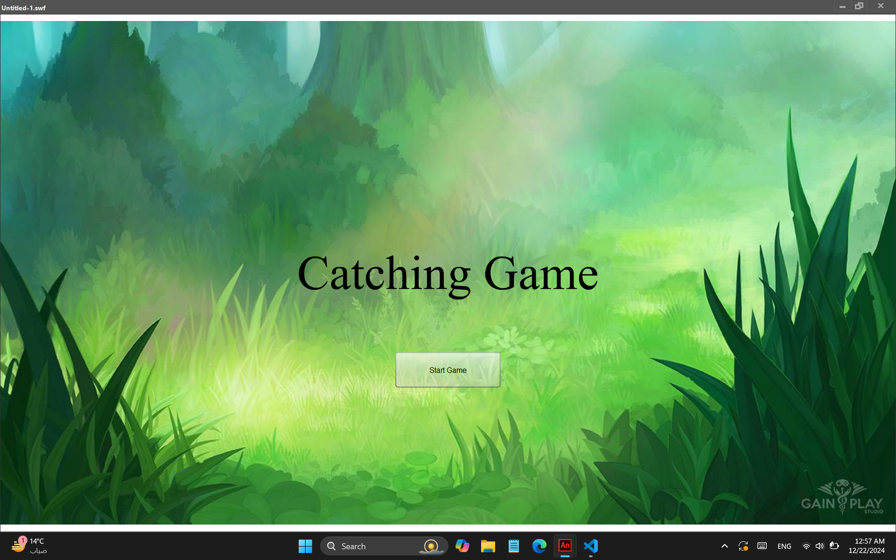
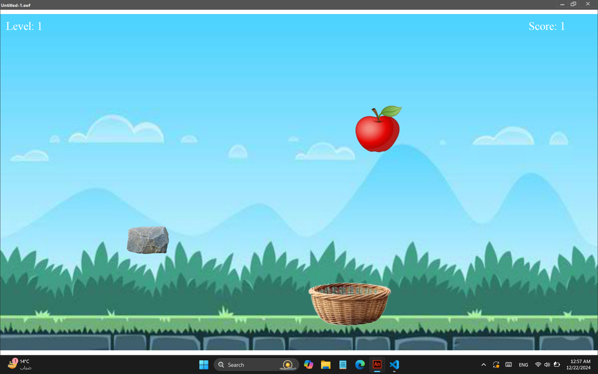
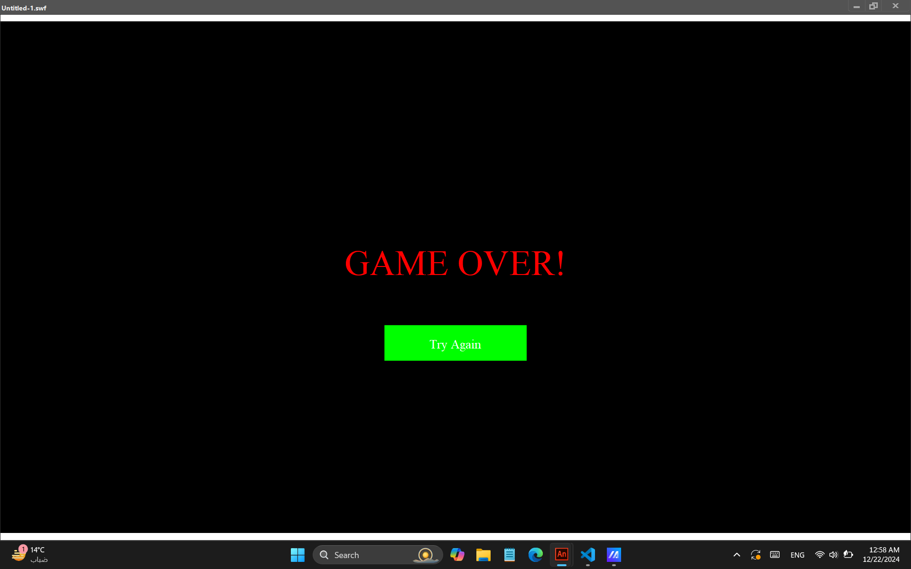

# Catch Falling Game

## Overview
This is a simple 2D game built using **ActionScript 3.0** where the player controls a basket to catch falling objects. The game includes various types of falling objects, some good and some bad. The player earns points for catching good objects and loses points for catching bad ones. The game features a dynamic difficulty system, increasing speed as the player advances in levels.

## Show Case

---

---

---
https://github.com/user-attachments/assets/e651cfa0-ccba-4325-b6b9-90fc86ccb7e2
## Features
- **Basket Control**: The player moves the basket left or right using the keyboard (arrow keys).
- **Falling Objects**: Different objects fall from the top of the screen, categorized into "good" and "bad" objects.
  - **Good Objects**: Increase the player's score when caught.
  - **Bad Objects**: Decrease the player's score when caught.
- **Levels**: The game increases in difficulty by speeding up the falling objects as the player progresses through levels.
- **Game Over**: When the player’s score goes below 0, the game ends and the option to restart is provided.
- **Score and Level Display**: Real-time tracking of the player's score and current level.
- **Sounds**: Unique sounds are played when objects are caught or missed.

## Installation
1. Clone the repository to your local machine:
   ```bash
   git clone https://github.com/mohyware/College-Stuff.git
   ```
2. Navigate to catch-falling-game directory
   ```bash
   cd Third-Year/catch-falling-game/
   ```
3. Open game.fla file in your preferred ActionScript 3.0 development environment (e.g., Adobe Animate or FlashDevelop).
4. Run the project to start playing the game.

## How to Play
1. Move the basket: Use the left and right arrow keys to move the basket across the screen.
2. Catch the objects: Try to catch the falling "good" objects to score points. Avoid catching the "bad" objects.
3. Game Over: The game ends when your score drops below 0, and you can restart the game by clicking the "Try Again" button.

## Acknowledgements

A special thanks to the following contributors for their valuable efforts and dedication to this project:

- [Youssef Hataba](https://github.com/youssef-hataba)  
- [Adel Kassem](https://github.com/orabi4)  
- [Youssef El sherbiny](https://github.com/Elsherbiny73)  
- Mostafa Ta7on 
